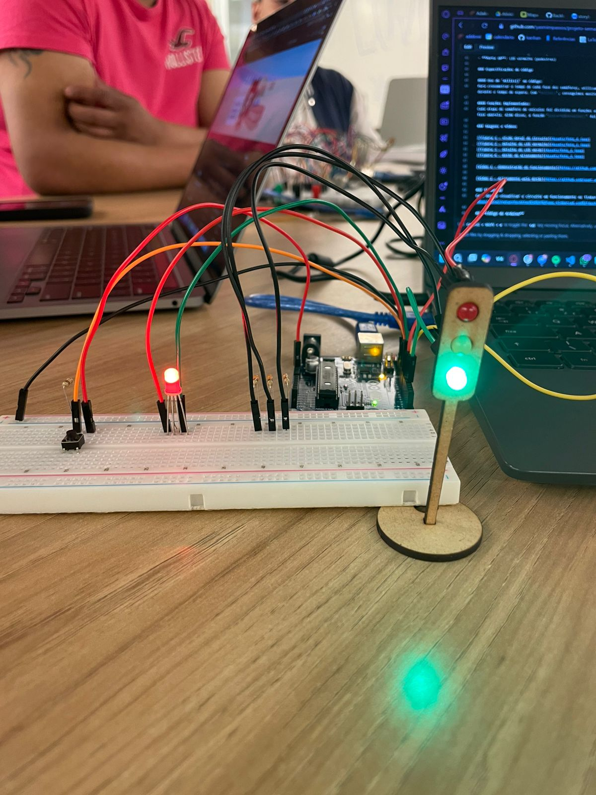
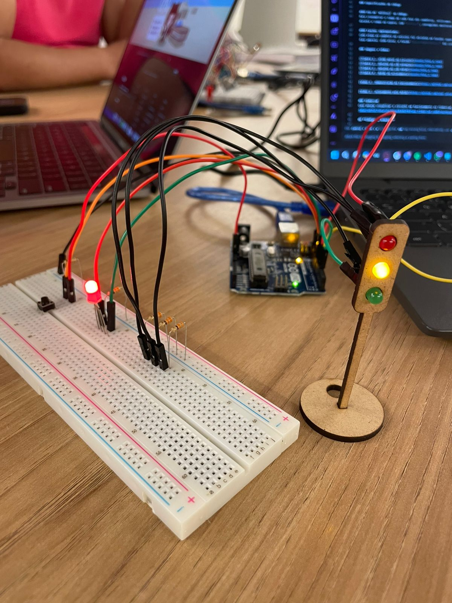
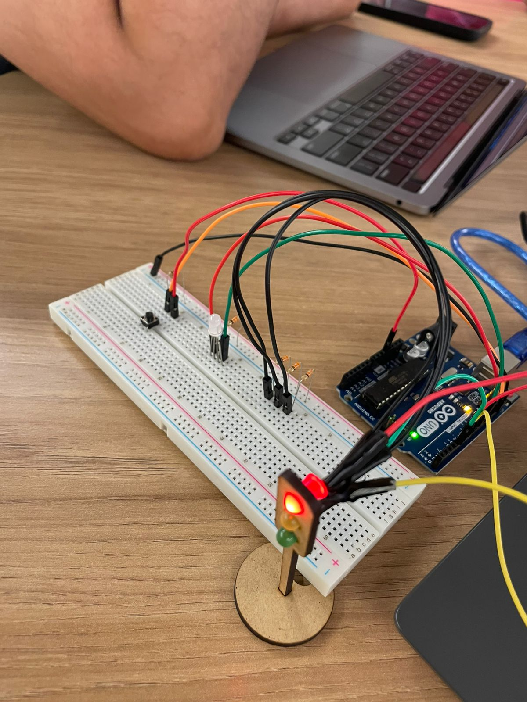
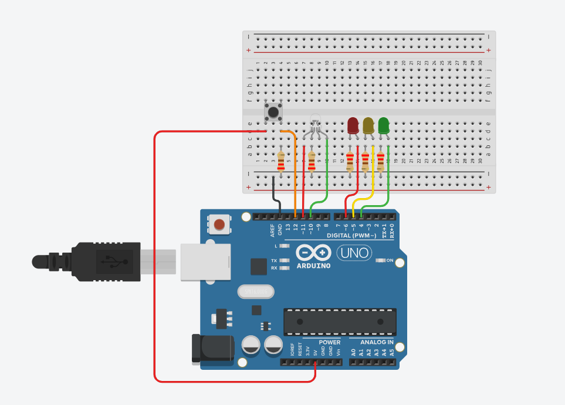

# Protótipo de Semáforo

## **Introdução**

Este é um projeto de semáforo em Arduino que simula um sistema de controle de tráfego que envolve a interação entre um semáforo para veículos e outro para pedestres. O sistema é projetado para funcionar de forma semelhante a um cruzamento real, garantindo a segurança e o fluxo ordenado de veículos e pedestres.

## **Descrição do Projeto**
O semáforo para veículos alterna entre as cores verde, amarela e vermelha, regulando o fluxo do tráfego. O semáforo de pedestres opera de forma sincronizada com o de veículos, garantindo a segurança nas travessias. Embora o semáforo de pedestres funcione automaticamente, ele também conta com um botão que simula o pedido de travessia por um pedestre. Quando o botão é pressionado e o semáforo de veículos está verde, o sistema responde mais rapidamente, mudando para amarelo e, em seguida, para vermelho, permitindo que o semáforo de pedestres acenda a luz verde para a travessia segura.

Quando o semáforo de veículos está vermelho, o semáforo de pedestres acende a luz verde, indicando que é seguro atravessar. Após um período, a luz verde muda para vermelha e começa a piscar, indicando que o tempo de travessia está se esgotando. Em todas as outras situações, a luz vermelha permanece acesa no semáforo de pedestres, sinalizando que não é seguro atravessar a rua.

## **Componentes Utilizados**

| Componente   | Quantidade | Descrição                                                 |
|--------------|------------|-----------------------------------------------------------|
| Arduino      | 1          | Modelo UNO                                                |
| Protoboard   | 1          | Para montagem do circuito                                 |
| LEDs         | 3          | Vermelho, amarelo e verde                                 |
| LED RGB      | 1          | Para o semáforo do pedestre                               |
| Botão        | 1          | Para pular a etapa verde do semaforo                      |
| Resistores   | 5          | Um para cada LED, tanto RGB como normal, e um para o botão|
| Fios jumper  | 11         | Para as conexões entre componentes e Arduino              |

## **Montagem do Circuito**

Inicialmente, o circuito foi projetado e testado no Tinkercad para garantir que o funcionamento fosse correto e que os componentes estivessem protegidos, permitindo ajustes antes da montagem final. Após a validação no ambiente de simulação, a montagem foi transferida para o circuito físico.

### Especificações da Montagem

#### Conexões e Cores dos Jumpers:
- **GND**: Utilizamos jumpers pretos para todas as conexões de terra.
- **LEDs**: As cores dos jumpers correspondem à cor de cada LED, facilitando a identificação visual.
- **Botão**: Utilizamos um jumper laranja para a conexão com a porta digital e um jumper vermelho para a conexão com o 5V.

#### Portas Utilizadas:
- **Porta 6**: LED vermelho (veículos)
- **Porta 4**: LED verde (veículos)
- **Porta 5**: LED amarelo (veículos)
- **Porta 12**: Botão (acionamento do pedestre)
- **Porta 9**: LED verde (pedestres)
- **Porta 10**: LED vermelho (pedestres)

### Especificações do Código

#### Uso de `millis()` no Código:
Para cronometrar o tempo de cada fase dos semáforos, utilizamos a função `millis()` em vez de `delay()`. Isso ocorre porque `delay()` pausa a execução do código, o que impediria a detecção do acionamento do botão durante o tempo de espera. Com `millis()`, conseguimos monitorar e gerenciar o tempo de forma eficiente, mantendo a resposta do sistema ativa e contínua.

#### Funções Implementadas:
Cada etapa do semáforo de veículos foi dividida em funções específicas, como `estadoVermelho()` para controlar a fase vermelha, `estadoVerde()` para controlar a fase verde e `estadoAmarelo()` para controlar a fase amarela. Além disso, a função `piscarRGBVermelho()` foi criada para controlar a piscada do LED vermelho dos pedestres durante a fase verde do semáforo de veículos.

### Imagens e Vídeos






[Vídeo 1 - Demonstração do Funcionamento](assets/videoFuncionamentoBasico.mp4)

[Vídeo 2 - Acionamento pelo Botão](assets/videoFuncionamentoBotao.mp4)

### Tinkercad
Caso deseje visualizar o circuito em funcionamento no Tinkercad, acesse o seguinte link: [Clique aqui para visualizar o circuito no Tinkercad](https://www.tinkercad.com/things/awYLafBXVhU-fantastic-duup-jaban/editel?returnTo=https%3A%2F%2Fwww.tinkercad.com%2Fdashboard)

## **Código do Arduino**

O código abaixo controla o protótipo do semáforo na IDE do Arduíno.
```c
#define LED_VERMELHO 6
#define LED_AMARELO 5
#define LED_VERDE 4
#define LED_RGB_VERDE 9
#define LED_RGB_VERMELHO 10
#define BOTAO 12

// variaveis que definem o intervalo entre cada estado
// no fim vai ter um total de 6s devido ser 3,5s ligados o vermelho e o verde do pedestre e os outros 2,5s com o led vermelho ligado e o led do vermelho do pedestre piscando
const int TEMPO_VERMELHO = 3500; 
const int TEMPO_AMARELO = 2000;
const int TEMPO_VERDE = 4000;

// variavel que define o intervalo entre as piscadas do led vermelho do pedestre
const int INTERVALO_PISCA = 500;

// variavel que define quantas piscadas o led vermelho do pedestre vai ter
const int PISCADAS_RGB_VERMELHO = 3;

// enum para definir em qual estado do semaforo está
enum Estados {
    ESTADO_VERMELHO,
    ESTADO_AMARELO,
    ESTADO_VERDE
};

// variaveis que serão utilizadas durante o código
int estado_botao;
long tempo_decorrido;
long tempo_anterior = 0;
long intervalo = 0;
bool estado_led_rgb = LOW;
int pisca_count = 0;
bool estadoVerdeAtivo = false;
Estados estado_atual = ESTADO_VERMELHO;
bool piscar_iniciado = false;

// configuração inicial dos pinos
void setup() {
    pinMode(LED_VERMELHO, OUTPUT);
    pinMode(LED_AMARELO, OUTPUT);
    pinMode(LED_VERDE, OUTPUT);
    pinMode(LED_RGB_VERDE, OUTPUT);
    pinMode(LED_RGB_VERMELHO, OUTPUT);
    pinMode(BOTAO, INPUT);
}

// loop onde acontece a lógica do código
void loop() {
  
  	// começa a contar o tempo decorrido desde o inicio do programa
    tempo_decorrido = millis();
  
  	// lê se o botão está pressionado ou não
    estado_botao = digitalRead(BOTAO);

  	// caso o botão estiver pressionado e o estado verde estiver ativo..
    if (estado_botao == HIGH && estadoVerdeAtivo) {
      
      	// modifica o estado atual para amarelo e define o intervalço atual como 0
        estado_atual = ESTADO_AMARELO;
        intervalo = 0;
    }

  	// verifica se já passou o tempo do intervalo 
    if (tempo_decorrido - tempo_anterior >= intervalo) {
      
      	// desliga todos os leds
        resetarLEDs();

      	// verifica em qual estado está para chamar as funções correspondentes
        switch (estado_atual) {
            case ESTADO_VERMELHO:
                estadoVermelho();
                break;

            case ESTADO_AMARELO:
                estadoAmarelo();
                break;

            case ESTADO_VERDE:
                estadoVerde();
                break;
        }
	
      	// modifica o tempo anterior para o tempo decorrido
      	// para poder verificar posteriormente se o tempo do intervalo passou
        tempo_anterior = tempo_decorrido;
    }
}

// função para desligar todos os leds
void resetarLEDs() {
    digitalWrite(LED_VERMELHO, LOW);
    digitalWrite(LED_AMARELO, LOW);
    digitalWrite(LED_VERDE, LOW);
    digitalWrite(LED_RGB_VERDE, LOW);
    digitalWrite(LED_RGB_VERMELHO, LOW);
}

// função que controla o estado vermelho
void estadoVermelho() {
  
  	// liga o led vermelho
    digitalWrite(LED_VERMELHO, HIGH);

  	// se o piscar não tiver iniciado ainda... (ou seja se não for o momento de piscar o led vermelho para o pedestre)
    if (!piscar_iniciado) {
      
      	// liga o led verde do pedestre
        digitalWrite(LED_RGB_VERDE, HIGH);
      	
      	// modifica quanto tempo o led verde do pedestre vai ficar ligado
        intervalo = TEMPO_VERMELHO;
      	
      	// informa que no proximo turno o led vermelho do pedestre vai começar a piscar
        piscar_iniciado = true;
      
    } else { // se for para o led vermelho do pedestre piscar ...
      	
      	// chama a função de piscar o led verm,elho do pedestre
        piscarRGBVermelho();
    }
}

// função para controlar o estado amarelo
void estadoAmarelo() {
  	
  	// liga o led vermelho do pedestre, pois ele não pode passar
    digitalWrite(LED_RGB_VERMELHO, HIGH);
  
  	// liga o led amarelo
    digitalWrite(LED_AMARELO, HIGH);
  
  	// modifica o intervalo para o que o led amarelo vai ficar ligado
    intervalo = TEMPO_AMARELO;
  
  	// muda para o próximo estado, se o verde estava ativo muda para o vermelho, se não vai para o verde
    estado_atual = estadoVerdeAtivo ? ESTADO_VERMELHO : ESTADO_VERDE;
  
  	// inverte a variavel estadoVerdeAtivo
    estadoVerdeAtivo = !estadoVerdeAtivo;
}

// função para controlar o estado verde
void estadoVerde() {
  	
  	// liga o led vermelho do pedestre, pois ele não pode passar
    digitalWrite(LED_RGB_VERMELHO, HIGH);
  
  	// liga o led verde
    digitalWrite(LED_VERDE, HIGH);
  
  	// modifica o intervalo para o que o led verde vai ficar ligado
    intervalo = TEMPO_VERDE;
  
  	// muda para o estado verde
    estado_atual = ESTADO_AMARELO;
}

// função ´para controlar a piscada do led vermelho do pedestre
void piscarRGBVermelho() {
  	
  	// modifica o estado do led
    estado_led_rgb = !estado_led_rgb;
  
  	// liga ou desliga o led de acordo com seu estado modificado anteriormente
    digitalWrite(LED_RGB_VERMELHO, estado_led_rgb);

  	// modifica o intervalo para o que o led vai piscar
    intervalo = INTERVALO_PISCA;

  	// caso o estado do led esteja como desligado significa que já deu uma piscada, ligou e desligou
    if (!estado_led_rgb) {
      	
      	// adiciona um na quantidade de vezes o led piscou
        pisca_count++;
    }
  
  	// verifica se já piscou a quantidade de vezes necessárias
    if (pisca_count >= PISCADAS_RGB_VERMELHO) {
      	
      	// liga o led vermelho do pedestre
        digitalWrite(LED_RGB_VERMELHO, HIGH);
      	
      	// reinicia a varia que acumula quantas vezes o led piscou
        pisca_count = 0;
      
      	// muda para o estado amarelo
        estado_atual = ESTADO_AMARELO;
      
      	// define o piscar iniciado como falso
        piscar_iniciado = false;
      
      	// define o estado do led como low
      	estado_led_rgb = LOW;
    }
}
```
## **Template Avaliação Pares**

### Avaliador: Matheus Fernandes

| Critério                                                                                                 | Contempla (Pontos) | Contempla Parcialmente (Pontos) | Não Contempla (Pontos) | Observações do Avaliador |
|---------------------------------------------------------------------------------------------------------|--------------------|----------------------------------|--------------------------|---------------------------|
| Montagem física com cores corretas, boa disposição dos fios e uso adequado de resistores                | 3              |                             |                         |                  A montagem foi muito bem executada, o protótipo tem uma boa organização dos fios e componentes eletrônicos         |
| Temporização adequada conforme tempos medidos com auxílio de algum instrumento externo                  | 3              |                       |                         |            A temporização foi feita da forma correta               |
| Código implementa corretamente as fases do semáforo e estrutura do código (variáveis representativas e comentários) | 3              |                          |                         |            O código está bem completo e foi além em sua execução               |
| Extra: Implmeentou um componente de liga/desliga no semáforo e/ou usou ponteiros no código | 1              |                          |                         |              Adicionou um botão para o pedestre             |
|  |                                                             |  | |*Pontuação Total: 10*|

### Avaliador: Davi Nascimento de Jesus
| Critério                                                                                                 | Contempla (Pontos) | Contempla Parcialmente (Pontos) | Não Contempla (Pontos) | Observações do Avaliador |
|---------------------------------------------------------------------------------------------------------|--------------------|----------------------------------|--------------------------|---------------------------|
| Montagem física com cores corretas, boa disposição dos fios e uso adequado de resistores                | Até 3              | Até 1,5                            | 0                        |  "Nota: 3. O projeto está excelente. A montagem física foi bem ajustada, considerando o posicionamento dos fios e a disposição dos componentes elétricos na protoboard. A ordem do semafóro está adequada conforme as instruções e os resistores estão colocados nos espaços corretos. "|
| Temporização adequada conforme tempos medidos com auxílio de algum instrumento externo                  | Até 3              | Até 1,5                          | 0                        | "Nota: 3. No semáforo, o projeto segue de forma correta a temporização das cores, seguindo a sequência 6 segundos no vermelho, 2 segundos no amarelo, 4 segundos no verde, 2 segundos no amarelo. " |
| Código implementa corretamente as fases do semáforo e estrutura do código (variáveis representativas e comentários) | Até 3              | Até 1,5                          | 0                        | "Nota:3. Além da implementação correta das fases do semáforo, um ponto de destaque do projeto da Yasmim é a modularização em funções específicas. Um processo que permite a explicabilidade e a legibilidade do código da melhor maneira. Ela aproveitou esse recurso bem." |
| Extra: Implementou um componente de liga/desliga no semáforo e/ou usou ponteiros no código | Até 1              |  Até 0,5                         | 0                        | "Nota: 1. O projeto conta com um botão que simula o disponibilizado para pedestres solicitarem a travessia. Além disso, apesar de ser um led que não contaria como um outro elemento, ela ainda acrescenta com o RGB um semáforo para pedestres." |
|  |                                                             |  | |**Pontuação Total:** 10|